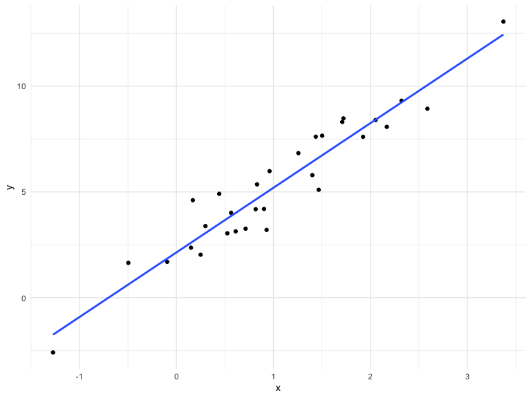

Simulations
================
Olya Besedina

# Simulation

``` r
set.seed(1)

sim_regression = function(n, beta0 = 2, beta1 = 3) {
  
  sim_data = tibble(
    x = rnorm(n, mean = 1, sd = 1),
    y = beta0 + beta1 * x + rnorm(n, 0, 1)
  )
  
  ls_fit = lm(y ~ x, data = sim_data)
  
  tibble(
    beta0_hat = coef(ls_fit)[1],
    beta1_hat = coef(ls_fit)[2]
  )
}
```

sim\_data = simulated dataset ls\_fit = fitted linear model tibble -
output

Error rnorm(n, 0, 1). Assumer that errors usually folow ~N.

``` r
sim_regression(n = 30)
```

    ## # A tibble: 1 x 2
    ##   beta0_hat beta1_hat
    ##       <dbl>     <dbl>
    ## 1      2.09      3.04

# rerun using a for loop - Repeated sampling

Simulate the data and fit linear regression 5000 times using loop

``` r
output = vector("list", length = 5000)

for (i in 1:5000) {
  
  output[[i]] = sim_regression(n = 30)
  
}

#output  # dont run this part

bind_rows(output) %>% 
  ggplot(aes(x = beta0_hat)) +
  geom_density()
```


Density plot above shows that most of the beta0 in 5000 samples are
around 2 - Bell shaped density plot.

# Rerun simulation using purr - Repeated sampling

There is a function that reruns function some number of times

Rerun is like map Rerun produces
lists

``` r
# Since there is no input data in rerun you need to spesify how many times you want to rerun the simulation, then function name
output = rerun(5000, sim_regression(n = 30)) %>% 
  bind_rows()


# gives you the same bell shaped curve as for loop

output %>% 
  ggplot(aes(x = beta0_hat)) +
  geom_density()
```


Scatter plot shows 5000 point for bate0 and beta1 for each simulation
out of 5000. Beta0 is spread between 1 and 3, centered at 2 Beta1 is
spread between 2.5 and 3.5 centered at 3 Those are the values that were
specified at the beginning of simulation

Unexpected: beta0 and beta1 are correlated. reason? If you change the
intercept your slope will also change. Check scatter plot below

``` r
output %>% 
  ggplot(aes(x = beta0_hat, y = beta1_hat)) +
  geom_point()
```


What is going on?

sim\_data = simulated data new with 30 simulations error var ~N(0,1)

``` r
sim_data = tibble(
    x = rnorm(30, mean = 1, sd = 1),
    y = 2 + 3 * x + rnorm(30, 0, 1)
  )
# scatter plot with linear regression

sim_data %>% 
  ggplot(aes(x = x, y = y)) + 
  geom_point() +
  stat_smooth(method = "lm", se = FALSE)
```



beta0 - est intercept beta1 - estimated slope

This table gives you mean of 5000 beta0 and beta1 and their var

``` r
output %>% 
  pivot_longer( 
    beta0_hat:beta1_hat,
    names_to = "parameter", 
    values_to = "estimate") %>% 
  group_by(parameter) %>% 
  summarize(emp_mean = mean(estimate),
            emp_var = var(estimate)) %>% 
  knitr::kable(digits = 3)
```

| parameter  | emp\_mean | emp\_var |
| :--------- | --------: | -------: |
| beta0\_hat |     2.005 |    0.072 |
| beta1\_hat |     2.995 |    0.037 |

Try another sample size - mean should stay the same, but varience should
decrease

``` r
n_list = list("n_30"  = 30, 
              "n_60"  = 60, 
              "n_120" = 120, 
              "n_240" = 240)

# for loop
 
output = vector("list", length = 4)

for (i in 1:4) {
  output[[i]] = rerun(1000, sim_regression(n_list[[i]])) %>% 
    bind_rows
}

# density plots for 1 and 4 tables 
output[[1]] %>% 
  ggplot(aes(x = beta0_hat)) + geom_density()
```


``` r
output[[4]] %>% 
  ggplot(aes(x = beta0_hat)) + geom_density()
```


``` r
# mean stayed the same, but varience decreased
```

Rerun produces lists

Vector is a generic function to create a list

1.  start with the tibble of sample sizes
2.  for each of those sample sizes rerun simulation 10 times
3.  take output and turn list into df
4.  remove list that you dont need
5.  unnest the tible

<!-- end list -->

``` r
sim_results = 
  tibble(
    sample_size = c(30, 60, 120, 240)
  ) %>% 
  # take information from for loop and turn into nicely formated structure
  # first mapping says take data from sample size, rerun 1000 tines using formula sim_regression
  mutate(
    output_list = map(.x = sample_size, ~ rerun(1000, sim_regression(n = .x))),
    # inctead of having a list, go across out_put list and bind rows
    output_df = map(output_list, bind_rows)
  ) %>% 
  select(-output_list) %>% 
  unnest(output_df)
```

post process

``` r
sim_results %>% 
  group_by(sample_size) %>% 
  summarize(var_bl = var(beta1_hat))
```

    ## # A tibble: 4 x 2
    ##   sample_size  var_bl
    ##         <dbl>   <dbl>
    ## 1          30 0.0380 
    ## 2          60 0.0184 
    ## 3         120 0.00864
    ## 4         240 0.00464

var decreases as sample size increases

fct\_inorder = says use the same order that appears in df, such as
sample size OR keep that order and do not rearrange in alphabetical
order

``` r
sim_results %>% 
  mutate(
    # add "n = " to every obs in sample size 
    sample_size = str_c("n = ", sample_size),
    # change order to in order of sample size
    sample_size = fct_inorder(sample_size)
  ) %>% 
  ggplot(aes(x = beta0_hat, y = beta1_hat)) +
  geom_point() +
  facet_grid(~sample_size)
```


As sample size increases, var decreases
