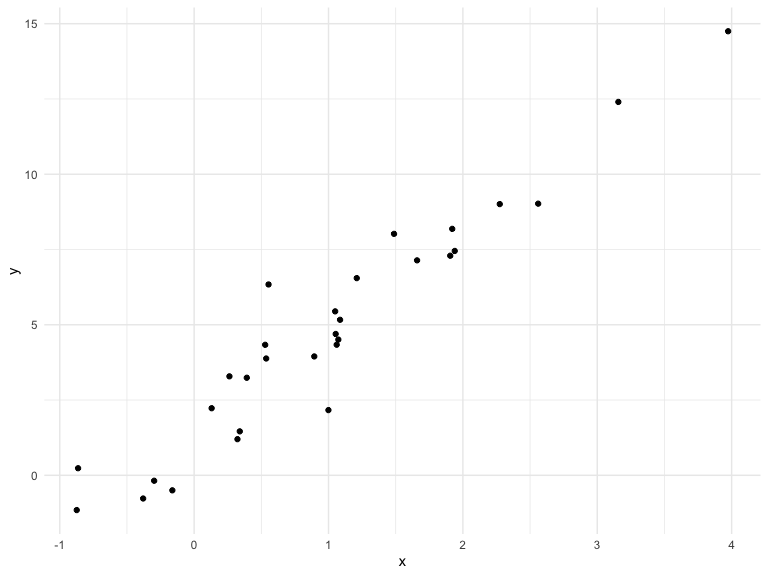

Writing functions
================
Olya Besedina

## Get started

``` r
x = rnorm(n = 30, mean = 4, sd = 2.3)
x_again = rnorm(n = 30, mean = 6, sd = .3)
y = rnorm(n = 30, mean = 6, sd = .3)

# z scores
(x - mean (x)) / sd(x)
```

    ##  [1] -0.09242343  0.51525554  0.49141157  0.54243359 -0.73249455
    ##  [6]  1.60480217 -1.55957403 -0.10003118  0.96883047  0.04132550
    ## [11] -0.85903048 -1.71065867 -1.42225900 -0.15799907 -0.55620984
    ## [16]  0.91223717 -0.97939691 -1.42548460 -0.72194688  0.07334746
    ## [21] -1.24439322  1.66637686  0.32366628 -0.15106478  0.18106197
    ## [26] -0.24080314  0.55396110  0.66651736  2.02778885  1.38475387

``` r
(x_again - mean (x_again)) / sd(x_again)
```

    ##  [1] -0.52702015 -0.42732294  0.30204426 -1.19078652  1.15638337
    ##  [6]  0.18867463 -1.59666635  0.76209253 -1.00767104  0.38186635
    ## [11]  2.36869969 -1.15547864  0.74543874  0.54031156 -0.18769176
    ## [16]  2.13065653 -0.66505974 -0.82856226 -0.75442946 -0.74060974
    ## [21] -1.22541058  0.24588037  1.29223553 -1.43386037  0.07594358
    ## [26] -0.02506402  0.52783987  0.99145874 -0.28329933  0.33940714

Now a function

``` r
z_score = function(x) {
  
  if(!is.numeric(x)) {
    stop("x should be numeric")
  } else if(length(x) < 3){
    stop( "x should be longer than 3")
  }
  
  (x - mean(x)) / sd(x)
  
}
```

Try out the function

``` r
z_score(x = x_again)

z_score(x = 3)
z_score (x = "my name is jeff")
z_score (x = c(TRUE, TRUE, FALSE, TRUE))
z_score(x = iris)
```

## Multiple output

If you want to create multiple output from one function you can orginize
in in a tibble.

``` r
mean_and_sd = function(input_x)
{
  
  if(!is.numeric(x)) {
    stop("x should be numeric")
  } else if(length(x) < 3){
    stop( "x should be longer than 3")
  }

  tibble(
    mean_input = mean(input_x),
    sd_input = sd(input_x)
  ) 
}
```

Test the function

``` r
mean_and_sd(input_x = x)
```

    ## # A tibble: 1 x 2
    ##   mean_input sd_input
    ##        <dbl>    <dbl>
    ## 1       3.29     2.28

# list - allows you to combine any number of things into one output structure

``` r
mean_and_sd_list = function(input_x)
{
  
  if(!is.numeric(x)) {
    stop("x should be numeric")
  } else if(length(x) < 3){
    stop( "x should be longer than 3")
  }

  list(
    mean_input = mean(input_x),
    sd_input = sd(input_x),
    z_score = (input_x - mean(input_x)) / sd(input_x)
  ) 
}
```

``` r
mean_and_sd_list(input_x = x)
```

    ## $mean_input
    ## [1] 3.288199
    ## 
    ## $sd_input
    ## [1] 2.276164
    ## 
    ## $z_score
    ##  [1] -0.09242343  0.51525554  0.49141157  0.54243359 -0.73249455
    ##  [6]  1.60480217 -1.55957403 -0.10003118  0.96883047  0.04132550
    ## [11] -0.85903048 -1.71065867 -1.42225900 -0.15799907 -0.55620984
    ## [16]  0.91223717 -0.97939691 -1.42548460 -0.72194688  0.07334746
    ## [21] -1.24439322  1.66637686  0.32366628 -0.15106478  0.18106197
    ## [26] -0.24080314  0.55396110  0.66651736  2.02778885  1.38475387

# Multiple inputs

y is related to x through the simple linear regression

``` r
sim_data = tibble(
  x = rnorm(30, mean = 1, sd = 1),
  y = 2 + 3 * x + rnorm(30, 0, 1)
)

sim_data %>% 
  ggplot(aes(x = x, y = y)) +
  geom_point()
```



``` r
ls_fit = lm(y ~ x, data = sim_data)
  
# estimated intercept:
beta0_hat = coef(ls_fit)[1]
# estimated slope
beta1_hat = coef(ls_fit)[2]
```

By defauld beta0= 2, beta1 = 3 unles changed by the user

``` r
sim_regression = function(n, beta0 = 2, beta1 = 3) {
  
  sim_data = tibble(
    x = rnorm(n, mean = 1, sd = 1),
    y = beta0 + beta1 * x + rnorm(n, 0, 1)
  )
  
  ls_fit = lm(y ~ x, data = sim_data)
  
  tibble(
    beta0_hat = coef(ls_fit)[1],
    beta1_hat = coef(ls_fit)[2]
  )
}

sim_regression(n = 3000, beta0 = 17, beta1 = -3)
```

    ## # A tibble: 1 x 2
    ##   beta0_hat beta1_hat
    ##       <dbl>     <dbl>
    ## 1      17.0     -2.98

``` r
# Can write in order without naming it
sim_regression(3000, beta0 = 24)
```

    ## # A tibble: 1 x 2
    ##   beta0_hat beta1_hat
    ##       <dbl>     <dbl>
    ## 1      24.0      3.02

# Scrape lots of napoleon

``` r
url = "https://www.amazon.com/product-reviews/B00005JNBQ/ref=cm_cr_arp_d_viewopt_rvwer?ie=UTF8&reviewerType=avp_only_reviews&sortBy=recent&pageNumber=1"

dynamite_html = read_html(url)

review_titles = dynamite_html %>%
  html_nodes("#cm_cr-review_list .review-title") %>%
  html_text()

review_stars = dynamite_html %>%
  html_nodes("#cm_cr-review_list .review-rating") %>%
  html_text()

review_text = dynamite_html %>%
  html_nodes(".review-text-content span") %>%
  html_text()

reviews = tibble(
  title = review_titles,
  stars = review_stars,
  text = review_text
)
```

Now as a function

``` r
read_page_reviews = function(page_url) {
  url = "https://www.amazon.com/product-reviews/B00005JNBQ/ref=cm_cr_arp_d_viewopt_rvwer?ie=UTF8&reviewerType=avp_only_reviews&sortBy=recent&pageNumber=1"

dynamite_html = read_html(page_url)

review_titles = dynamite_html %>%
  html_nodes("#cm_cr-review_list .review-title") %>%
  html_text()

review_stars = dynamite_html %>%
  html_nodes("#cm_cr-review_list .review-rating") %>%
  html_text()

review_text = dynamite_html %>%
  html_nodes(".review-text-content span") %>%
  html_text()

reviews = tibble(
  title = review_titles,
  stars = review_stars,
  text = review_text
)

reviews

}

read_page_reviews("https://www.amazon.com/product-reviews/B00005JNBQ/ref=cm_cr_arp_d_viewopt_rvwer?ie=UTF8&reviewerType=avp_only_reviews&sortBy=recent&pageNumber=1")
```

    ## # A tibble: 10 x 3
    ##    title                           stars     text                          
    ##    <chr>                           <chr>     <chr>                         
    ##  1 "\n\n\n\n\n\n\n\n  \n  \n    H… 5.0 out … One of the greatest movies of…
    ##  2 "\n\n\n\n\n\n\n\n  \n  \n    W… 5.0 out … What a classic! Love this mov…
    ##  3 "\n\n\n\n\n\n\n\n  \n  \n    V… 5.0 out … and all your wildest dreams w…
    ##  4 "\n\n\n\n\n\n\n\n  \n  \n    O… 5.0 out … Watched it a few times now, s…
    ##  5 "\n\n\n\n\n\n\n\n  \n  \n    H… 5.0 out … Seen it 100 times bit couldn'…
    ##  6 "\n\n\n\n\n\n\n\n  \n  \n    👍… 5.0 out … Good movie. So stupid funny! …
    ##  7 "\n\n\n\n\n\n\n\n  \n  \n    S… 5.0 out … I actually bought this for my…
    ##  8 "\n\n\n\n\n\n\n\n  \n  \n    C… 1.0 out … Wasnt aware this could be cha…
    ##  9 "\n\n\n\n\n\n\n\n  \n  \n    I… 5.0 out … An offbeat refreshing diversi…
    ## 10 "\n\n\n\n\n\n\n\n  \n  \n    C… 4.0 out … Classic

``` r
read_page_reviews("https://www.amazon.com/product-reviews/B00005JNBQ/ref=cm_cr_arp_d_viewopt_rvwer?ie=UTF8&reviewerType=avp_only_reviews&sortBy=recent&pageNumber=2")
```

    ## # A tibble: 10 x 3
    ##    title                         stars      text                           
    ##    <chr>                         <chr>      <chr>                          
    ##  1 "\n\n\n\n\n\n\n\n  \n  \n   … 5.0 out o… Cant explain. Love this movie. 
    ##  2 "\n\n\n\n\n\n\n\n  \n  \n   … 5.0 out o… One of my favorite go to movies
    ##  3 "\n\n\n\n\n\n\n\n  \n  \n   … 5.0 out o… Great movie                    
    ##  4 "\n\n\n\n\n\n\n\n  \n  \n   … 5.0 out o… It came quickly delivered by a…
    ##  5 "\n\n\n\n\n\n\n\n  \n  \n   … 5.0 out o… ❤️👊❤️👊Still one of my top movi…
    ##  6 "\n\n\n\n\n\n\n\n  \n  \n   … 5.0 out o… It’s about time my kids watche…
    ##  7 "\n\n\n\n\n\n\n\n  \n  \n   … 4.0 out o… It is a funny movie. The film …
    ##  8 "\n\n\n\n\n\n\n\n  \n  \n   … 5.0 out o… Exactly what I expected        
    ##  9 "\n\n\n\n\n\n\n\n  \n  \n   … 5.0 out o… Good                           
    ## 10 "\n\n\n\n\n\n\n\n  \n  \n   … 5.0 out o… Good movie

``` r
read_page_reviews("https://www.amazon.com/product-reviews/B00005JNBQ/ref=cm_cr_arp_d_viewopt_rvwer?ie=UTF8&reviewerType=avp_only_reviews&sortBy=recent&pageNumber=3")
```

    ## # A tibble: 10 x 3
    ##    title                           stars     text                          
    ##    <chr>                           <chr>     <chr>                         
    ##  1 "\n\n\n\n\n\n\n\n  \n  \n    M… 5.0 out … The Steak to the face bike ri…
    ##  2 "\n\n\n\n\n\n\n\n  \n  \n    F… 5.0 out … I did not know what I was mis…
    ##  3 "\n\n\n\n\n\n\n\n  \n  \n    P… 5.0 out … Just what I wanted.           
    ##  4 "\n\n\n\n\n\n\n\n  \n  \n    N… 4.0 out … A throwback of weird funny ou…
    ##  5 "\n\n\n\n\n\n\n\n  \n  \n    N… 4.0 out … Its okay                      
    ##  6 "\n\n\n\n\n\n\n\n  \n  \n    A… 1.0 out … Don't waste your money or you…
    ##  7 "\n\n\n\n\n\n\n\n  \n  \n    I… 5.0 out … you have to watch it!         
    ##  8 "\n\n\n\n\n\n\n\n  \n  \n    V… 4.0 out … Good movie                    
    ##  9 "\n\n\n\n\n\n\n\n  \n  \n    F… 5.0 out … So funny... old, but funy     
    ## 10 "\n\n\n\n\n\n\n\n  \n  \n    F… 5.0 out … This is a niche movie for adu…

``` r
read_page_reviews("https://www.amazon.com/product-reviews/B00005JNBQ/ref=cm_cr_arp_d_viewopt_rvwer?ie=UTF8&reviewerType=avp_only_reviews&sortBy=recent&pageNumber=4")
```

    ## # A tibble: 10 x 3
    ##    title                           stars     text                          
    ##    <chr>                           <chr>     <chr>                         
    ##  1 "\n\n\n\n\n\n\n\n  \n  \n    A… 5.0 out … Vote for Pedro and buy a key-…
    ##  2 "\n\n\n\n\n\n\n\n  \n  \n    A… 5.0 out … I bought it so I can show eac…
    ##  3 "\n\n\n\n\n\n\n\n  \n  \n    I… 5.0 out … Become one with your inner ne…
    ##  4 "\n\n\n\n\n\n\n\n  \n  \n    G… 5.0 out … I shared this movie with my y…
    ##  5 "\n\n\n\n\n\n\n\n  \n  \n    B… 5.0 out … This is the best movie of all…
    ##  6 "\n\n\n\n\n\n\n\n  \n  \n    g… 5.0 out … this movie is really funny hi…
    ##  7 "\n\n\n\n\n\n\n\n  \n  \n    P… 5.0 out … Everything                    
    ##  8 "\n\n\n\n\n\n\n\n  \n  \n    C… 5.0 out … Classic movie and hilarious!!!
    ##  9 "\n\n\n\n\n\n\n\n  \n  \n    I… 5.0 out … Great movie...classic         
    ## 10 "\n\n\n\n\n\n\n\n  \n  \n    G… 5.0 out … Great quality.

# Lord of the rings data

``` r
library(readxl)
fellowship_ring = readxl::read_excel("./data/LotR_Words.xlsx", range = "B3:D6") %>%
  mutate(movie = "fellowship_ring")

two_towers = readxl::read_excel("./data/LotR_Words.xlsx", range = "F3:H6") %>%
  mutate(movie = "two_towers")

return_king = readxl::read_excel("./data/LotR_Words.xlsx", range = "J3:L6") %>%
  mutate(movie = "return_king")

lotr_tidy = bind_rows(fellowship_ring, two_towers, return_king) %>%
  janitor::clean_names() %>%
  gather(key = sex, value = words, female:male) %>%
  mutate(race = str_to_lower(race)) %>% 
  select(movie, everything()) 
```

As a function

``` r
lotr_load_and_tidy = function(path, range, movie_name) {
  
  df = readxl::read_excel(path, range = range) %>%
    janitor::clean_names() %>%
    gather(key = sex, value = words, female:male) %>%
    mutate(race = str_to_lower(race),
           movie = movie_name)
  
  df
  
}

lotr_tidy = 
  bind_rows(
    lotr_load_and_tidy("./data/LotR_Words.xlsx", "B3:D6", "fellowship_ring"),
    lotr_load_and_tidy("./data/LotR_Words.xlsx", "F3:H6", "two_towers"),
    lotr_load_and_tidy("./data/LotR_Words.xlsx", "J3:L6", "return_king")) %>%
  select(movie, everything()) 
```

``` r
x = rnorm(25, 0, 1)

my_summary = function(x, summ_func) {
  summ_func(x)
}

my_summary(x, sd)
```

    ## [1] 0.9447517
