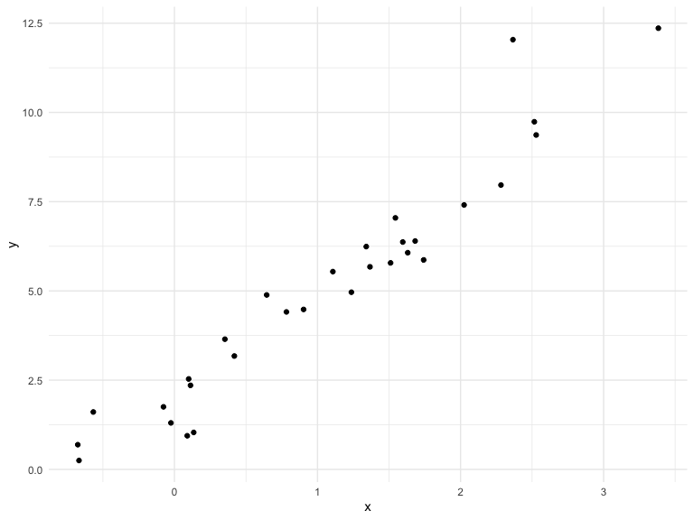

Writing functions
================
Olya Besedina

## Get started

``` r
x = rnorm(n = 30, mean = 4, sd = 2.3)
x_again = rnorm(n = 30, mean = 6, sd = .3)
y = rnorm(n = 30, mean = 6, sd = .3)

# z scores
(x - mean (x)) / sd(x)
```

    ##  [1] -1.0650087  0.5162744  1.2197401 -0.2378328  0.4585260 -1.1097325
    ##  [7]  0.3123635 -0.9781389  2.0642461  0.9870695 -1.8587092 -0.4397817
    ## [13] -1.5015575  0.0706886  0.2429724  0.6212064  1.3251087  0.1555759
    ## [19]  0.1377664 -1.0519453  0.3696434 -2.3123534 -0.4425774  0.7397337
    ## [25] -0.4861820  0.6117588  0.3297672  0.3560619  1.3561942 -0.3908777

``` r
(x_again - mean (x_again)) / sd(x_again)
```

    ##  [1]  0.74149669  1.19269852 -1.73005195  0.58393737  0.25232781
    ##  [6] -0.53047209 -0.32178453 -1.91390904  0.74980596 -0.04267836
    ## [11] -0.22366173  1.19873541 -1.42012856  0.92343693  0.32419788
    ## [16]  0.29488762 -0.04185599  0.54815236  1.45595907  0.22609752
    ## [21]  0.44654757 -0.05927983 -2.67727935 -0.41567142 -0.56020668
    ## [26]  0.86497749  0.97974334 -0.72595750 -1.03381843  0.91375394

Now a function

``` r
z_score = function(x) {
  
  if(!is.numeric(x)) {
    stop("x should be numeric")
  } else if(length(x) < 3){
    stop( "x should be longer than 3")
  }
  
  (x - mean(x)) / sd(x)
  
}
```

Try out the function

``` r
z_score(x = x_again)

z_score(x = 3)
z_score (x = "my name is jeff")
z_score (x = c(TRUE, TRUE, FALSE, TRUE))
z_score(x = iris)
```

## Multiple output

``` r
mean_and_sd = function(input_x)
{
  
  if(!is.numeric(x)) {
    stop("x should be numeric")
  } else if(length(x) < 3){
    stop( "x should be longer than 3")
  }

  tibble(
    mean_input = mean(input_x),
    sd_input = sd(input_x)
  ) 
}
```

Thest the function

``` r
mean_and_sd(input_x = x)
```

    ## # A tibble: 1 x 2
    ##   mean_input sd_input
    ##        <dbl>    <dbl>
    ## 1       3.63     2.23

# list - allows you to combine any number of things into one output structure

``` r
mean_and_sd_list = function(input_x)
{
  
  if(!is.numeric(x)) {
    stop("x should be numeric")
  } else if(length(x) < 3){
    stop( "x should be longer than 3")
  }

  list(
    mean_input = mean(input_x),
    sd_input = sd(input_x),
    z_score = (input_x - mean(input_x)) / sd(input_x)
  ) 
}
```

# Multiple inputs

y is relatd to x through the simple linear regression

``` r
sim_data = tibble(
  x = rnorm(30, mean = 1, sd = 1),
  y = 2 + 3 * x + rnorm(30, 0, 1)
)

sim_data %>% 
  ggplot(aes(x = x, y = y)) +
  geom_point()
```



``` r
ls_fit = lm(y ~ x, data = sim_data)
  
# estimated intercept:
beta0_hat = coef(ls_fit)[1]
# estimated slope
beta1_hat = coef(ls_fit)[2]
```

By defauld beta0= 2, beta1 = 3 unles changed by the user

``` r
sim_regression = function(n, beta0 = 2, beta1 = 3) {
  
  sim_data = tibble(
    x = rnorm(n, mean = 1, sd = 1),
    y = beta0 + beta1 * x + rnorm(n, 0, 1)
  )
  
  ls_fit = lm(y ~ x, data = sim_data)
  
  tibble(
    beta0_hat = coef(ls_fit)[1],
    beta1_hat = coef(ls_fit)[2]
  )
}

sim_regression(n = 3000, beta0 = 17, beta1 = -3)
```

    ## # A tibble: 1 x 2
    ##   beta0_hat beta1_hat
    ##       <dbl>     <dbl>
    ## 1      17.0     -3.02

``` r
# Can write in order without naming it
sim_regression(3000, beta0 = 24)
```

    ## # A tibble: 1 x 2
    ##   beta0_hat beta1_hat
    ##       <dbl>     <dbl>
    ## 1      24.0      2.98

# Scrape lots of napoleon

``` r
url = "https://www.amazon.com/product-reviews/B00005JNBQ/ref=cm_cr_arp_d_viewopt_rvwer?ie=UTF8&reviewerType=avp_only_reviews&sortBy=recent&pageNumber=1"

dynamite_html = read_html(url)

review_titles = dynamite_html %>%
  html_nodes("#cm_cr-review_list .review-title") %>%
  html_text()

review_stars = dynamite_html %>%
  html_nodes("#cm_cr-review_list .review-rating") %>%
  html_text()

review_text = dynamite_html %>%
  html_nodes(".review-text-content span") %>%
  html_text()

reviews = tibble(
  title = review_titles,
  stars = review_stars,
  text = review_text
)
```

Now as a function

``` r
read_page_reviews = function(page_url) {
  url = "https://www.amazon.com/product-reviews/B00005JNBQ/ref=cm_cr_arp_d_viewopt_rvwer?ie=UTF8&reviewerType=avp_only_reviews&sortBy=recent&pageNumber=1"

dynamite_html = read_html(page_url)

review_titles = dynamite_html %>%
  html_nodes("#cm_cr-review_list .review-title") %>%
  html_text()

review_stars = dynamite_html %>%
  html_nodes("#cm_cr-review_list .review-rating") %>%
  html_text()

review_text = dynamite_html %>%
  html_nodes(".review-text-content span") %>%
  html_text()

reviews = tibble(
  title = review_titles,
  stars = review_stars,
  text = review_text
)

reviews

}

read_page_reviews("https://www.amazon.com/product-reviews/B00005JNBQ/ref=cm_cr_arp_d_viewopt_rvwer?ie=UTF8&reviewerType=avp_only_reviews&sortBy=recent&pageNumber=1")
```

    ## # A tibble: 10 x 3
    ##    title                   stars       text                                
    ##    <chr>                   <chr>       <chr>                               
    ##  1 "Gotta watch it!\n    … 5.0 out of… Super fun cult film. A must-see! Fu…
    ##  2 "Great movie\n        … 5.0 out of… Love this movie.                    
    ##  3 "Duh\n            "     5.0 out of… Best movie ever                     
    ##  4 "Great video\n        … 5.0 out of… Product as described.  Great transa…
    ##  5 "Give me some of your … 5.0 out of… This movie will always be my favori…
    ##  6 "Nostalgic\n          … 5.0 out of… One of the best nostalgic movies of…
    ##  7 "Make you giggle type … 5.0 out of… "I love, love, love this movie.  It…
    ##  8 "This movie is so stup… 5.0 out of… No, really.  It's so stupid.  Your …
    ##  9 "Hilarious\n          … 5.0 out of… Hilarious                           
    ## 10 "Waste of money\n     … 1.0 out of… Terrible movie! Please don’t waste …

``` r
read_page_reviews("https://www.amazon.com/product-reviews/B00005JNBQ/ref=cm_cr_arp_d_viewopt_rvwer?ie=UTF8&reviewerType=avp_only_reviews&sortBy=recent&pageNumber=2")
```

    ## # A tibble: 10 x 3
    ##    title                       stars      text                             
    ##    <chr>                       <chr>      <chr>                            
    ##  1 "Good movie\n            "  5.0 out o… Funny                            
    ##  2 "A classic\n            "   5.0 out o… I like your sleeves. They're rea…
    ##  3 "FRIKKEN SWEET MOVIE, GAWS… 5.0 out o… It’s Napolean Dynamite. It’s cha…
    ##  4 "You gonna eat the rest of… 5.0 out o… One of my favorite movies ever. …
    ##  5 "Tina you fat lard come ge… 5.0 out o… It's a great movie               
    ##  6 "Great family movie\n     … 5.0 out o… My kids as well as the adults lo…
    ##  7 "Teens love it\n          … 5.0 out o… Original and funny               
    ##  8 "Great\n            "       5.0 out o… Funny                            
    ##  9 "Great Movie, Bad Packagin… 4.0 out o… First off, the stick-on label on…
    ## 10 "jeez napoleon\n          … 5.0 out o… gosh

``` r
read_page_reviews("https://www.amazon.com/product-reviews/B00005JNBQ/ref=cm_cr_arp_d_viewopt_rvwer?ie=UTF8&reviewerType=avp_only_reviews&sortBy=recent&pageNumber=3")
```

    ## # A tibble: 10 x 3
    ##    title                     stars       text                              
    ##    <chr>                     <chr>       <chr>                             
    ##  1 "👍\n            "        5.0 out of… 👍                                
    ##  2 "A classic!\n           … 5.0 out of… A classic movie.  Hilarious!      
    ##  3 "A must own\n           … 5.0 out of… Great movie                       
    ##  4 "If you like 80s ...you … 5.0 out of… My all time favorite movie. I hav…
    ##  5 "🤘\n            "        5.0 out of… 🤘                                
    ##  6 "Super Slow Mooovie...\n… 1.0 out of… Too slow and too damn quiet... My…
    ##  7 "Awesome!\n            "  5.0 out of… Love this movie !                 
    ##  8 "Very funny\n           … 4.0 out of… Very funny                        
    ##  9 "Eat your food tina\n   … 5.0 out of… Cant go wrong                     
    ## 10 "Dumb funny\n           … 5.0 out of… Dumb funny

``` r
read_page_reviews("https://www.amazon.com/product-reviews/B00005JNBQ/ref=cm_cr_arp_d_viewopt_rvwer?ie=UTF8&reviewerType=avp_only_reviews&sortBy=recent&pageNumber=4")
```

    ## # A tibble: 10 x 3
    ##    title                         stars      text                           
    ##    <chr>                         <chr>      <chr>                          
    ##  1 "Annoying! Not in a good way… 1.0 out o… I know that I am one of the ve…
    ##  2 "Fun\n            "           5.0 out o… Fun                            
    ##  3 "such a great movie\n       … 5.0 out o… a true comedy classic          
    ##  4 "Napoleon Dud\n            "  3.0 out o… Not impressed w/movie.         
    ##  5 "Five stars\n            "    5.0 out o… Such a weird, awesome movie    
    ##  6 "Fun!\n            "          5.0 out o… Great movie                    
    ##  7 "Funny movie- bravo for Amaz… 5.0 out o… My son loves this movie, so I …
    ##  8 "Movie\n            "         5.0 out o… Movie                          
    ##  9 "Funny movie, quotable lines… 5.0 out o… My kids quote this movie all t…
    ## 10 "Great for teenagers!\n     … 5.0 out o… My students loved this movie.

# Lord of the rings data

``` r
library(readxl)
fellowship_ring = readxl::read_excel("./data/LotR_Words.xlsx", range = "B3:D6") %>%
  mutate(movie = "fellowship_ring")

two_towers = readxl::read_excel("./data/LotR_Words.xlsx", range = "F3:H6") %>%
  mutate(movie = "two_towers")

return_king = readxl::read_excel("./data/LotR_Words.xlsx", range = "J3:L6") %>%
  mutate(movie = "return_king")

lotr_tidy = bind_rows(fellowship_ring, two_towers, return_king) %>%
  janitor::clean_names() %>%
  gather(key = sex, value = words, female:male) %>%
  mutate(race = str_to_lower(race)) %>% 
  select(movie, everything()) 
```

As a function

``` r
lotr_load_and_tidy = function(path, range, movie_name) {
  
  df = readxl::read_excel(path, range = range) %>%
    janitor::clean_names() %>%
    gather(key = sex, value = words, female:male) %>%
    mutate(race = str_to_lower(race),
           movie = movie_name)
  
  df
  
}

lotr_tidy = 
  bind_rows(
    lotr_load_and_tidy("./data/LotR_Words.xlsx", "B3:D6", "fellowship_ring"),
    lotr_load_and_tidy("./data/LotR_Words.xlsx", "F3:H6", "two_towers"),
    lotr_load_and_tidy("./data/LotR_Words.xlsx", "J3:L6", "return_king")) %>%
  select(movie, everything()) 
```

``` r
x = rnorm(25, 0, 1)

my_summary = function(x, summ_func) {
  summ_func(x)
}

my_summary(x, sd)
```

    ## [1] 0.8358458
